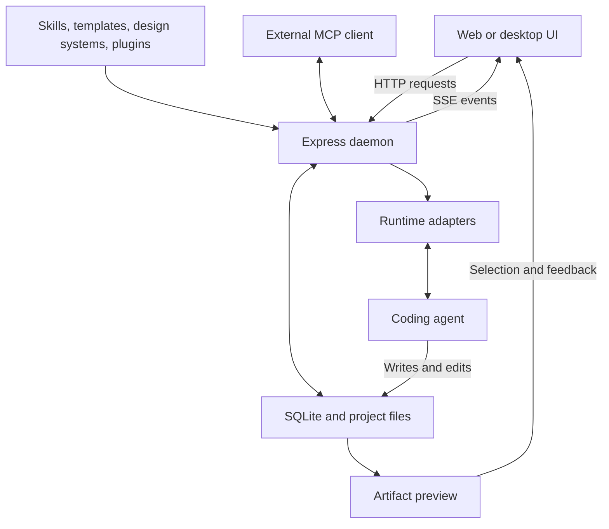

# OpenDesign Architecture & Workflow Review

**Audience:** AI engineers, frontend architects, and product teams  
**Subject:** How OpenDesign combines design guidance, coding agents, and live preview  
**Review date:** October 2, 2026  
**Upstream repository:** [nexu-io/open-design](https://github.com/nexu-io/open-design)  
**Source snapshot inspected:** [`53231d40b778d88eba23f35547bf99485d3ae9fc`](https://github.com/nexu-io/open-design/tree/53231d40b778d88eba23f35547bf99485d3ae9fc)

> **Scope:** This article is based on repository documentation and selected implementation files. It explains the architecture and its expected benefits; it is not a runtime test, security audit, or comparative benchmark. Implementation details refer to the snapshot above and may change.

---

## 1. Executive Summary: What Is OpenDesign?

**OpenDesign is an open-source design workspace that brings together reusable design instructions, coding agents, project files, and live preview.** A user supplies a brief, selects design guidance, generates an artifact, reviews it, and requests further changes in the same project.

Its central architectural choice is to reuse existing coding agents rather than implement every agent's reasoning and tool loop itself. In a filesystem-backed CLI run, OpenDesign prepares the prompt and workspace, launches the selected agent, and presents its streamed output and generated files. The coding agent owns the model calls and tool execution.

For example, a team could ask for an analytics dashboard using an existing brand package. The agent receives the design rules and workflow instructions, writes project files, and the team reviews the rendered result. Feedback on a selected element provides additional context for the next edit.

OpenDesign also supports BYOK/API workflows and multiple deployment forms. The local CLI workflow is an important execution path, but it does not describe every supported mode. The product covers more than frontend prototypes, including slides, images, and video.

**The practical value is a connected creation-and-review workflow.** Consistent styling, faster iteration, and reusable code are potential benefits; they still depend on the chosen agent, instructions, task, and validation.

Sources: [README][readme], [Agent adapters][adapters].

## 2. The Problem: What a Single-Turn Code Prompt Leaves Out

A single prompt can produce useful UI code. However, a text response alone does not provide a complete workflow for organizing files, applying brand rules, previewing changes, and reviewing the result.

| Challenge | What OpenDesign Adds | Remaining Limitation |
| --- | --- | --- |
| Styling varies between generations. | Explicit design-system context and reusable instructions. | The agent can still misinterpret or ignore a rule. |
| Code arrives as text that must be placed into a project. | Filesystem-backed generation and project-file management. | Generated code still needs review. |
| Feedback such as “change that card” is ambiguous. | Selection and comments tied to rendered elements. | The agent must still identify the correct source change. |
| Iteration requires switching between disconnected tools. | Chat, files, preview, and review within a project. | Workflow quality varies by runtime and artifact type. |

These capabilities are not exclusive to OpenDesign. Other coding-agent workflows can edit files, run commands, and use browser tools. OpenDesign's contribution is packaging those capabilities into a design-oriented workspace with reusable content and review surfaces.

## 3. High-Level Architecture

The main components have different responsibilities:

| Component | Responsibility |
| --- | --- |
| **Web UI** | Project navigation, chat, file workspace, preview, and review interactions. |
| **Express daemon** | APIs, persistence, prompt composition, runtime launch, cancellation, and streamed events. |
| **SQLite and project storage** | Persistent application state and managed project files. Imported projects can use a selected external folder. |
| **Runtime adapters** | Describe how to detect and communicate with supported coding-agent runtimes. |
| **Coding agent** | Performs model calls, manages its own agent loop, and uses its available tools. |
| **Content registries** | Supply skills, rendering templates, design systems, and plugins. |
| **Preview renderer** | Displays project artifacts and supports applicable inspection and feedback bridges. |
| **MCP interface** | Exposes structured capabilities to external MCP-compatible clients. |

The browser or desktop renderer communicates with the daemon using HTTP APIs and server-sent events (SSE). SSE lets the UI receive progress and output while a run is underway. The `od` CLI also calls the daemon's HTTP APIs.



This diagram is a simplified view of the filesystem-backed execution path. MCP is an integration surface; it should not be treated as the transport for every UI interaction or runtime event.

Source: [Architecture][architecture].

## 4. Reusable Guidance: Four Different Roles

OpenDesign distinguishes several kinds of reusable content:

| Content Type | Purpose | Example |
| --- | --- | --- |
| **Functional skill** | Instructions for a capability or workflow. | How to carry out a design task. |
| **Design template** | A rendering-oriented starting point. | A dashboard or presentation blueprint. |
| **Design system** | Brand tokens, visual rules, and supporting assets. | Colors, typography, components, and usage guidance. |
| **Plugin** | An installable bundle with workflow and integration metadata. | A packaged capability available through the marketplace. |

Functional skills and design templates both use the `SKILL.md` instruction convention, but they have separate registries and listing APIs. Calling every layout blueprint a “functional skill” hides that distinction.

### The Design Contract: `DESIGN.md`

`DESIGN.md` makes visual expectations explicit. Depending on the selected package, it can describe colors, spacing, typography, layout principles, and prohibited patterns. Some design-system packages also include tokens, components, assets, or provenance information.

For example, instructions might require a restrained palette, a particular heading font, and consistent spacing. This gives the agent a clearer starting point than a request to “make it look professional.” An 8px grid is a possible design rule, not a universal OpenDesign requirement.

**A written design contract is guidance, not automatic enforcement.** The documented workflow composes design context into the prompt. Reliable compliance requires checking the output, potentially with visual review, token checks, accessibility checks, or other validation.

### Procedural Instructions: `SKILL.md`

`SKILL.md` describes how the agent should approach the task. It can reference supporting files, assets, and workflow steps. The daemon composes selected instruction bodies and stages selected bundles under the project's `.od-skills/` directory so their supporting files remain accessible.

Sources: [Skills protocol][skills], [Agent adapters][adapters], [README][readme].

## 5. From Brief to Preview: The Execution Lifecycle

For a filesystem-backed coding-agent run, the workflow can be understood in seven steps:

1. **Create or select a project.** The project provides a workspace and persisted context.
2. **Submit the brief.** The user requests an artifact or a change.
3. **Compose context.** The daemon resolves the design system, skill or template, project information, and applicable additions.
4. **Launch the runtime.** The selected adapter supplies the appropriate invocation and transport settings.
5. **Execute the task.** The coding agent reads and edits files and uses the tools available to it.
6. **Stream progress and preview output.** OpenDesign normalizes runtime events for the UI and displays project artifacts.
7. **Review and iterate.** The user supplies further instructions or element-linked feedback.

The agent may run commands, inspect errors, and attempt fixes. That capability comes from its tools and instructions; OpenDesign does not guarantee that every task is compiled, linted, tested, or successfully repaired.

“Persistent agent” also needs qualification. Runtime adapters differ in their process lifecycle, session continuation, and transport. Resuming a conversation does not necessarily mean keeping the same operating-system process alive indefinitely.

The workspace should not be described universally as `.od/`. Managed project storage derives from the daemon's resolved data root, while imported projects can use an external folder.

Source: [Agent adapters][adapters]; see [Architecture][architecture] for storage and runtime boundaries.

## 6. The Click-to-Edit Feedback Loop

Element-linked feedback helps connect a user's visual intent to the rendered artifact.

The preview implementation supports identifiers such as `data-od-id` and `data-screen-label`. In the inspected source, the `srcDoc` rendering path can automatically annotate selected structural HTML elements that lack these identifiers. Browser tooling also contains selector fallbacks.

The interaction is conceptually:

1. The user selects an element in the preview.
2. OpenDesign captures identifying context, such as the selector, text, position, or an HTML hint.
3. The user adds a comment describing the desired change.
4. The selected feedback is supplied to the agent through the review/chat workflow.
5. The agent edits the project, and the user reviews the result.

**Illustrative example — not the application's exact wire schema:**

```json
{
  "elementId": "stats-summary-card",
  "selector": "[data-od-id='stats-summary-card']",
  "note": "Reduce the badge font size to 12px."
}
```

This gives the agent more useful context than “change the card on the right.” However, a DOM selector does not automatically identify an exact source-code line. The agent still needs to locate the relevant markup or component and apply an appropriate edit.

**Focused feedback reduces ambiguity; it does not prevent every regression.** After editing, the team should check the selected element and any affected layout or interactions.

Sources: [Preview annotation and bridges][srcdoc], [File viewer and comment handling][viewer], [Browser selection tools][browser-tools].

## 7. MCP and Preview Inspection Are Different Interfaces

MCP gives compatible external agents a structured way to work with OpenDesign. The inspected MCP tool definitions include project and file discovery, file access, artifact creation, skill/plugin listing, and run lifecycle operations.

For example, an external agent can request project context or start a run without navigating the graphical interface manually.

Preview selection and inspection use browser-side bridges and host message handling. Those features should not be described as automatically available through the main MCP server. Any claim that an MCP client can inspect a live DOM or read critique logs should identify the specific tool or resource that provides it.

Sources: [MCP implementation][mcp], [Architecture][architecture].

## 8. Working with Real Data

There are several possible ways to use data in a prototype. These are development patterns enabled by files and browser code, rather than evidence of a built-in production data-ingestion pipeline.

| Pattern | How It Works | What to Check |
| --- | --- | --- |
| **Local data files** | The agent reads JSON, CSV, or other accessible files and uses their contents in the artifact. | Parsing, correct values, sensitive data, and whether data is embedded or loaded at runtime. |
| **Schema-guided mock data** | The agent generates sample records based on an interface or schema. | Validate the records; a supplied schema alone does not guarantee valid output. |
| **API-backed prototype** | Generated browser code fetches data from an endpoint. | Authentication, CORS, iframe behavior, network policy, and error handling. |

A local backend URL may be usable in a particular deployment, but browser and daemon security boundaries can affect connectivity. Test the intended configuration rather than assuming every endpoint is accessible.

For early exploration, sanitized sample data is often sufficient. Before using organizational data, verify which files and prompts are sent to the selected agent or model provider. Never embed private API keys in frontend code.

## 9. Team Workflow and Engineering Handoff

| Stage | OpenDesign Workflow | Team Responsibility |
| --- | --- | --- |
| **Define** | Write a brief and select relevant design guidance. | Clarify users, requirements, and success criteria. |
| **Explore** | Generate and review artifacts in the workspace. | Evaluate usability and suitability. |
| **Refine** | Supply instructions and element-linked feedback. | Check the result and surrounding behavior. |
| **Hand off** | Reuse or export generated files. | Integrate with the application's architecture and services. |
| **Prepare for production** | Continue development with the chosen tools. | Complete testing, accessibility, security, performance, and deployment work. |

**Runnable code is a useful starting point, but it is not automatically production-ready.** Generated HTML may be appropriate for a prototype, while a production React application may require restructuring, shared components, state management, and backend integration.

The repository documents agent-assisted handoff and exports. It does not establish universal time savings. Claims such as “minutes instead of weeks” require a defined task and measured comparison.

Source: [README][readme].

## 10. Limitations and Security Boundaries

Several boundaries matter when evaluating the architecture:

- **Local-first does not mean offline inference.** Local agents can still call remote model providers. The actual data flow depends on the selected runtime and provider configuration.
- **Preview isolation and agent execution permissions are separate.** A sandboxed iframe limits browser behavior; it does not define a CLI agent's filesystem or command permissions.
- **Adapter behavior varies.** Tool access, permission settings, session handling, and capabilities are runtime-specific.
- **Public or shared hosting needs configuration.** The documented architecture calls for explicit authentication, origin, and reverse-proxy settings.
- **Design guidance needs verification.** Prompt instructions cannot guarantee correct styling, valid code, or accessibility.

These limits help teams decide how to run OpenDesign and what validation to add around it.

Sources: [Architecture — security boundaries][architecture], [Agent adapters][adapters], [README][readme].

## 11. What a Practical Evaluation Should Measure

To move from an architecture review to an evidence-based evaluation, compare OpenDesign with another workflow using the same brief, model or agent, design rules, and acceptance criteria.

Useful measures include:

- Time to the first acceptable prototype, including review and corrections.
- Adherence to the selected design rules.
- Responsive behavior and accessibility issues.
- Number of unintended changes during refinement.
- Engineering effort needed for integration.
- Model usage, cost, and failed or repeated runs.

For example, ask both workflows to create the same dashboard and then modify one selected card. Review the final artifacts against a common checklist. That would provide stronger evidence than assuming that filesystem access or element selection necessarily produces better results.

## 12. Key Takeaways

- OpenDesign connects design guidance, coding agents, files, preview, and review in one workspace.
- The daemon coordinates the workflow; the selected coding agent owns its agent loop and tools.
- `DESIGN.md` and `SKILL.md` make expectations explicit, but compliance requires validation.
- Element-linked feedback makes requests clearer without guaranteeing regression-free edits.
- Generated artifacts can support engineering handoff, while production readiness remains a separate responsibility.

---

## Source References

The following links are pinned to the inspected commit so readers can verify the implementation described here.

1. [README and product overview][readme]
2. [Architecture and deployment boundaries][architecture]
3. [Agent adapter contract and execution lifecycle][adapters]
4. [Skills protocol and registry distinctions][skills]
5. [MCP tool definitions and implementation][mcp]
6. [Preview rendering, annotations, and bridges][srcdoc]
7. [File viewer, inspection, and comment handling][viewer]
8. [Browser selection and inspection tools][browser-tools]
9. [Daemon data directory contract][agents]

[readme]: https://github.com/nexu-io/open-design/blob/53231d40b778d88eba23f35547bf99485d3ae9fc/README.md
[architecture]: https://github.com/nexu-io/open-design/blob/53231d40b778d88eba23f35547bf99485d3ae9fc/docs/architecture.md
[adapters]: https://github.com/nexu-io/open-design/blob/53231d40b778d88eba23f35547bf99485d3ae9fc/docs/agent-adapters.md
[skills]: https://github.com/nexu-io/open-design/blob/53231d40b778d88eba23f35547bf99485d3ae9fc/docs/skills-protocol.md
[mcp]: https://github.com/nexu-io/open-design/blob/53231d40b778d88eba23f35547bf99485d3ae9fc/apps/daemon/src/mcp.ts
[srcdoc]: https://github.com/nexu-io/open-design/blob/53231d40b778d88eba23f35547bf99485d3ae9fc/apps/web/src/runtime/srcdoc.ts
[viewer]: https://github.com/nexu-io/open-design/blob/53231d40b778d88eba23f35547bf99485d3ae9fc/apps/web/src/components/FileViewer.tsx
[browser-tools]: https://github.com/nexu-io/open-design/blob/53231d40b778d88eba23f35547bf99485d3ae9fc/apps/web/src/components/design-browser-tools.ts
[agents]: https://github.com/nexu-io/open-design/blob/53231d40b778d88eba23f35547bf99485d3ae9fc/AGENTS.md
